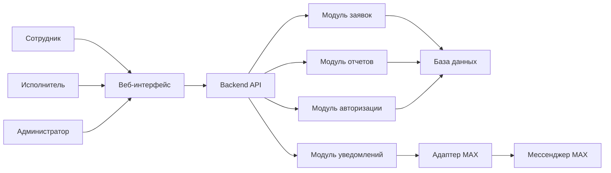
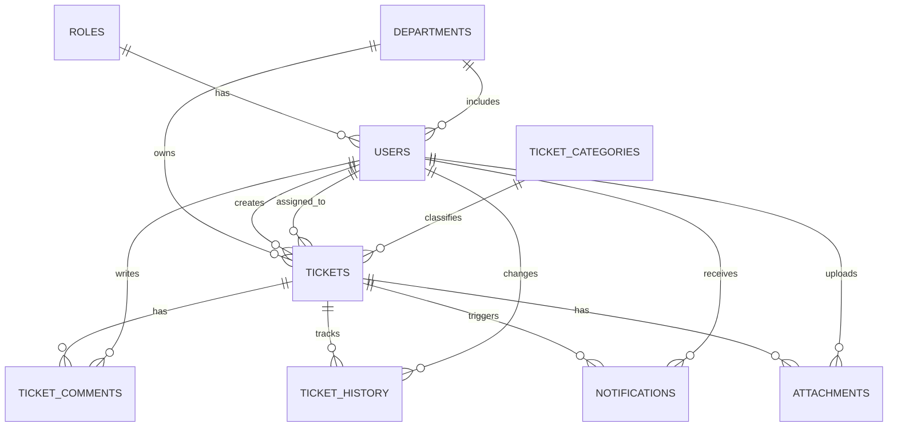

# Архитектурный план проекта и магистерской работы

## 1. Рабочее название проекта

**Разработка прототипа веб-системы внутренних заявок медицинской организации и моделирование DevOps-процессов ее непрерывной поставки.**

Краткое название: **система внутренних заявок с MAX-уведомлениями**.

Мессенджер MAX рассматривается не как центральная тема работы, а как интеграционный модуль практического проекта. Основной фокус магистерской работы - моделирование процессов разработки, проверки, сборки, поставки и сопровождения программного продукта.

## 2. Связь с темой магистерской работы

Тема магистерской работы: **"Моделирование процессов DevOps для обеспечения непрерывной поставки программного обеспечения"**.

Проект связывает тему магистерской работы с практикой в медицинской организации через разработку небольшого внутреннего программного продукта. DevOps в данном случае не внедряется как отдельная культура управления всей организацией, а применяется к жизненному циклу конкретной информационной системы: от разработки и тестирования до сборки, доставки, развертывания и контроля работоспособности.

Основная идея:

- разработать веб-приложение для учета внутренних заявок сотрудников;
- предусмотреть интеграцию с мессенджером MAX как каналом уведомлений;
- описать и смоделировать DevOps-процессы, обеспечивающие непрерывную поставку этого приложения;
- показать, как автоматизация снижает риски ручной установки, ошибок при обновлении и задержек при выпуске новых версий.

## 3. Цель проекта и магистерской работы

Разработать архитектуру и прототип веб-системы для регистрации, обработки и контроля внутренних заявок сотрудников ГБУЗ "ДГП Новороссийска" МЗ КК, а также смоделировать DevOps-процессы непрерывной поставки программного обеспечения для данной системы.

Финальным результатом должны стать два связанных артефакта:

- **программный проект** - прототип веб-системы внутренних заявок с контейнеризацией, тестами, mock/MAX-уведомлениями и CI/CD-пайплайном;
- **магистерская работа** - текстовое исследование и проектное описание, включающее анализ предметной области, требования, архитектуру, модель данных, DevOps-модель, тестовую стратегию, риски и оценку результата.

## 4. Задачи проекта

1. Проанализировать предметную область внутренних заявок в медицинской организации.
2. Определить роли пользователей и основные сценарии работы.
3. Спроектировать архитектуру веб-приложения.
4. Спроектировать модель данных для учета заявок, пользователей, статусов и комментариев.
5. Реализовать прототип системы с веб-интерфейсом и REST API.
6. Предусмотреть интеграционный модуль для уведомлений через мессенджер MAX и обязательную mock-реализацию на случай недоступности внешнего API.
7. Разработать модель DevOps-процессов: управление кодом, тестирование, сборка, контейнеризация, доставка и развертывание.
8. Настроить пример CI/CD-пайплайна для автоматической проверки и поставки приложения.
9. Описать тестовую стратегию, критерии приемки MVP и минимальный мониторинг.
10. Описать меры информационной безопасности, управление секретами и ограничения по персональным данным.
11. Сформировать структуру магистерской работы и связать требования с реализацией.
12. Оценить практическую применимость решения для организации.

## 5. Проблема, которую решает система

Во многих организациях внутренние заявки обрабатываются через устные обращения, телефонные звонки, бумажные записи или разрозненные сообщения в мессенджерах. Это приводит к нескольким проблемам:

- теряется история обращений;
- сложно понять, кто отвечает за заявку;
- нет прозрачного статуса выполнения;
- невозможно быстро собрать статистику по обращениям;
- заявки могут дублироваться или забываться;
- руководителю сложно оценить нагрузку и сроки выполнения.

Система внутренних заявок решает эту проблему за счет единой точки регистрации, статусов обработки, комментариев, ответственных исполнителей и уведомлений.

## 6. Границы проекта

Проект не является медицинской информационной системой и не предназначен для обработки медицинских данных пациентов.

В рамках магистерского проекта система работает с внутренними организационными заявками, например:

- неисправность компьютера;
- проблема с принтером или МФУ;
- отсутствие доступа к рабочему месту;
- необходимость настройки программного обеспечения;
- заявка на замену оборудования;
- обращение по хозяйственному или техническому вопросу.

В систему не включаются:

- электронные медицинские карты;
- персональные медицинские данные пациентов;
- запись пациентов на прием;
- интеграция с федеральными или региональными медицинскими системами;
- юридически значимый электронный документооборот.

Такое ограничение делает проект реалистичным, безопасным и подходящим для магистерской работы.

В форме создания заявки должно быть предупреждение о запрете ввода данных пациентов, диагнозов, номеров полисов и иной медицинской информации. Для демонстрации используются тестовые пользователи и обезличенные примеры заявок.

## 7. Основные пользователи и роли

### 7.1. Сотрудник

Сотрудник создает заявку и отслеживает ее выполнение.

Возможности:

- создать заявку;
- указать категорию, приоритет, кабинет и описание проблемы;
- прикрепить комментарий;
- просмотреть статус своих заявок;
- получить уведомление об изменении статуса.

### 7.2. Исполнитель

Исполнитель обрабатывает заявки.

Возможности:

- просматривать назначенные заявки;
- брать заявку в работу;
- менять статус;
- оставлять комментарии;
- отмечать выполнение;
- видеть историю своих задач.

### 7.3. Администратор

Администратор управляет системой.

Возможности:

- управлять пользователями;
- назначать исполнителей;
- редактировать справочники категорий;
- просматривать все заявки;
- формировать отчеты;
- контролировать журнал действий.

### 7.4. Руководитель или ответственный сотрудник

Руководитель анализирует качество обработки заявок.

Возможности:

- просматривать сводную статистику;
- видеть просроченные заявки;
- оценивать нагрузку исполнителей;
- получать отчеты по категориям и периодам.

### 7.5. Матрица ролей и прав

| Действие | Сотрудник | Исполнитель | Администратор | Руководитель |
|---|---:|---:|---:|---:|
| Создать заявку | Да | Да | Да | Да |
| Смотреть свои заявки | Да | Да | Да | Да |
| Смотреть все заявки | Нет | Ограниченно | Да | Да |
| Смотреть назначенные заявки | Нет | Да | Да | Да |
| Назначить исполнителя | Нет | Нет | Да | Нет |
| Изменить статус | Ограниченно | Да | Да | Нет |
| Добавить комментарий | Да | Да | Да | Ограниченно |
| Подтвердить выполнение своей заявки | Да | Да | Да | Нет |
| Смотреть отчеты | Нет | Нет | Да | Да |
| Управлять пользователями | Нет | Нет | Да | Нет |

Ограниченный доступ означает, что пользователь может выполнить действие только в рамках своей заявки или своей зоны ответственности.

## 8. Функциональные требования

### 8.1. Управление заявками

Система должна позволять:

- создавать заявку;
- редактировать заявку до принятия в работу;
- назначать ответственного исполнителя;
- изменять статус заявки;
- задавать приоритет;
- добавлять комментарии;
- просматривать историю изменений;
- фильтровать заявки по статусу, категории, исполнителю и периоду.

### 8.2. Статусы заявки

Предлагаемая модель статусов:

- **Новая** - заявка создана и ожидает обработки;
- **Назначена** - заявке назначен исполнитель;
- **В работе** - исполнитель начал выполнение;
- **Ожидает уточнения** - требуется дополнительная информация от заявителя;
- **Выполнена** - работа завершена;
- **Закрыта** - заявитель или администратор подтвердил завершение;
- **Отклонена** - заявка не может быть выполнена в рамках системы.

Переходы статусов фиксируются в истории заявки. Сотрудник может закрыть только собственную выполненную заявку, исполнитель может переводить назначенную заявку в работу и выполнение, администратор может управлять полным жизненным циклом заявки.

### 8.3. Таблица допустимых переходов статусов

| Текущий статус | Допустимые следующие статусы | Кто может выполнить |
|---|---|---|
| Новая | Назначена, Отклонена | Администратор |
| Назначена | В работе, Отклонена | Исполнитель, администратор |
| В работе | Ожидает уточнения, Выполнена, Отклонена | Исполнитель, администратор |
| Ожидает уточнения | В работе, Отклонена | Исполнитель, администратор |
| Выполнена | Закрыта, В работе | Сотрудник, администратор |
| Закрыта | Нет | Нет |
| Отклонена | Нет | Нет |

Повторное открытие закрытой заявки не входит в MVP. При необходимости оно может быть добавлено как отдельное расширение с отдельным правилом аудита.

Сотрудник в статусе "Ожидает уточнения" может добавить комментарий с уточнением, после чего исполнитель или администратор возвращает заявку в статус "В работе".

### 8.4. SLA и расчет просрочки

Для магистерского прототипа используется упрощенная модель SLA, зависящая от приоритета заявки:

| Приоритет | Срок выполнения |
|---|---:|
| Высокий | 4 рабочих часа |
| Средний | 1 рабочий день |
| Низкий | 3 рабочих дня |

Правила:

- срок выполнения записывается в поле `sla_due_at`;
- просрочка рассчитывается сравнением текущего времени с `sla_due_at`;
- изменение приоритета пересчитывает срок выполнения;
- изменение приоритета и срока фиксируется в `ticket_history`;
- рабочий календарь в MVP моделируется упрощенно, без учета праздников и сложных графиков смен.

### 8.5. Категории заявок

Примеры категорий:

- компьютерная техника;
- принтеры и МФУ;
- доступы и учетные записи;
- программное обеспечение;
- сеть и интернет;
- хозяйственные вопросы;
- другое.

### 8.6. Уведомления

Система должна отправлять уведомления:

- заявителю при создании заявки;
- исполнителю при назначении новой заявки;
- заявителю при изменении статуса;
- исполнителю при новом комментарии.

Основной канал уведомлений в проекте: **мессенджер MAX**.

Если реальный API MAX недоступен в учебной среде, система должна использовать mock-провайдер уведомлений. Он сохраняет событие отправки, канал, статус, время и текст ошибки, если отправка завершилась неуспешно.

Для обязательного MVP реализуются уведомления о создании, назначении, изменении статуса и новом комментарии. Уведомления о просрочке относятся к демонстрационному плюсу, если реализован расчет SLA.

### 8.7. Отчеты

Система должна формировать:

- количество заявок за период;
- распределение заявок по статусам;
- распределение заявок по категориям;
- среднее время выполнения;
- список просроченных заявок;
- нагрузку по исполнителям.

## 9. Нефункциональные требования

### 9.1. Надежность

Система должна сохранять историю заявок и изменений, чтобы восстановить ход обработки обращения.

### 9.2. Удобство использования

Интерфейс должен быть простым, так как пользователями могут быть сотрудники без технической подготовки.

### 9.3. Безопасность

Требуется:

- разграничение доступа по ролям;
- хранение паролей в виде хешей;
- защита API от неавторизованного доступа;
- журналирование важных действий;
- минимизация обрабатываемых персональных данных;
- хранение секретов базы данных и интеграции MAX только через переменные окружения;
- наличие файла `.env.example` без реальных секретов;
- исключение реальных `.env`-файлов, токенов и дампов базы данных из репозитория.

Минимальные правила аутентификации:

- пароли хешируются алгоритмом `bcrypt` или `argon2`;
- JWT имеет ограниченное время жизни;
- refresh-токены в MVP можно не реализовывать, если это указано в документации;
- endpoint `/auth/login` не возвращает пароль или `password_hash`;
- ошибки авторизации не раскрывают, существует ли пользователь;
- действия администратора фиксируются в журнале.

### 9.4. Масштабируемость

Система проектируется как небольшое внутреннее приложение, но архитектура должна позволять добавлять новые категории заявок, роли и каналы уведомлений.

### 9.5. Сопровождаемость

Код должен храниться в системе контроля версий, проходить автоматическую проверку и поставляться через CI/CD-пайплайн.

### 9.6. Наблюдаемость

В MVP включается минимальная наблюдаемость:

- endpoint `/health` для проверки доступности backend;
- структурированные логи backend;
- логирование ошибок отправки уведомлений;
- сохранение статуса уведомлений в базе данных;
- описание реакции на неуспешный деплой в документации проекта.

## 10. Архитектура системы

### 10.1. Общая архитектура

Предлагается использовать трехуровневую архитектуру:

1. **Клиентский уровень** - веб-интерфейс пользователя.
2. **Серверный уровень** - backend-приложение с бизнес-логикой и REST API.
3. **Уровень данных** - база данных для хранения заявок, пользователей, комментариев и истории действий.

Отдельным компонентом выделяется **интеграционный модуль MAX**, который отвечает за отправку уведомлений и, при наличии технической возможности, прием команд от пользователя.

### 10.2. Компоненты

Основные компоненты:

- веб-интерфейс;
- API управления заявками;
- модуль аутентификации и авторизации;
- модуль управления пользователями;
- модуль отчетов;
- модуль уведомлений;
- адаптер MAX;
- база данных;
- CI/CD-пайплайн;
- тестовый и продуктивный контуры развертывания.

### 10.3. Логическая схема



## 11. Интеграция с мессенджером MAX

### 11.1. Роль MAX в проекте

MAX используется как дополнительный коммуникационный канал. Основная система остается веб-приложением, а мессенджер помогает быстрее донести важные события до сотрудников.

Это снижает риск перегрузить магистерский проект: интеграция с MAX не заменяет систему заявок, а расширяет ее.

### 11.2. Минимальный вариант интеграции

На первом этапе MAX используется только для исходящих уведомлений:

- новая заявка назначена исполнителю;
- статус заявки изменен;
- по заявке добавлен комментарий;
- заявка выполнена;
- заявка просрочена.

### 11.3. Расширенный вариант интеграции

Если API MAX позволяет реализовать бота или входящие команды, можно добавить:

- создание заявки через MAX-бота;
- просмотр списка своих активных заявок;
- добавление комментария через MAX;
- подтверждение выполнения заявки;
- смену статуса исполнителем через команду.

### 11.4. Архитектурный подход к интеграции

Чтобы не зависеть жестко от конкретного мессенджера, вводится абстракция:

```text
NotificationProvider
    sendMessage(userId, text)
    sendTicketStatusChanged(ticketId, userId, status)
    sendTicketAssigned(ticketId, executorId)
```

Конкретная реализация:

```text
MaxNotificationProvider
```

Если API MAX временно недоступен или его нельзя использовать в учебной среде, для демонстрации можно реализовать mock-провайдер, который записывает уведомления в журнал или отправляет их в тестовый интерфейс.

В магистерской работе это можно описать как адаптер интеграции с внешним коммуникационным сервисом.

### 11.5. Ограничение зависимости от MAX

Интеграция с MAX не должна быть критическим условием работоспособности проекта. Если внешний сервис недоступен, основная система заявок продолжает работать, а событие уведомления получает статус ошибки или статус `mock_sent`.

Это позволяет защитить проект независимо от внешнего API и одновременно показать архитектурно корректную интеграцию:

- бизнес-логика заявки не зависит от конкретного мессенджера;
- адаптер MAX можно заменить другой реализацией `NotificationProvider`;
- результат отправки уведомления сохраняется в таблице `notifications`;
- ошибка отправки не приводит к потере заявки или откату основного действия.

## 12. Предлагаемый технологический стек

Для реализации прототипа выбран следующий стек:

- **backend:** Python FastAPI;
- **frontend:** React;
- **database:** PostgreSQL;
- **migrations:** Alembic;
- **authentication:** JWT;
- **tests:** pytest, HTTPX;
- **containers:** Docker и Docker Compose;
- **CI/CD:** GitHub Actions;
- **API documentation:** OpenAPI/Swagger;
- **version control:** Git.

Альтернативные варианты рассматривались на этапе выбора, но в реализации не используются.

Причина выбора: стек современный, понятный для демонстрации, хорошо документируется, поддерживает OpenAPI из коробки и не требует тяжелой инфраструктуры.

## 13. Модель данных

### 13.1. Основные сущности

Предлагаемые таблицы:

- `users` - пользователи системы;
- `roles` - роли пользователей;
- `tickets` - заявки;
- `ticket_categories` - категории заявок;
- `ticket_comments` - комментарии;
- `ticket_history` - история изменений;
- `notifications` - отправленные уведомления;
- `departments` - подразделения или кабинеты;
- `attachments` - вложения к заявкам, не входят в MVP и рассматриваются как расширение.

### 13.2. Связи между сущностями

Основные внешние ключи:

- `users.role_id -> roles.id`;
- `users.department_id -> departments.id`;
- `tickets.created_by -> users.id`;
- `tickets.assigned_to -> users.id`;
- `tickets.category_id -> ticket_categories.id`;
- `tickets.department_id -> departments.id`;
- `ticket_comments.ticket_id -> tickets.id`;
- `ticket_comments.author_id -> users.id`;
- `ticket_history.ticket_id -> tickets.id`;
- `ticket_history.changed_by -> users.id`;
- `notifications.ticket_id -> tickets.id`;
- `notifications.user_id -> users.id`.
- `attachments.ticket_id -> tickets.id`;
- `attachments.uploaded_by -> users.id`.

ER-диаграмма:



### 13.3. Сущность `users`

Основные поля:

- `id`;
- `login`;
- `email`;
- `password_hash`;
- `full_name`;
- `role_id`;
- `department_id`;
- `position`;
- `office_room`;
- `max_user_id`;
- `is_active`;
- `created_at`;
- `updated_at`.

### 13.4. Сущность `tickets`

Основные поля:

- `id`;
- `title`;
- `description`;
- `category_id`;
- `priority`;
- `status`;
- `created_by`;
- `assigned_to`;
- `department_id`;
- `room`;
- `created_at`;
- `updated_at`;
- `sla_due_at`;
- `closed_at`;
- `closed_by`.

### 13.5. Сущность `ticket_history`

История нужна для прозрачности обработки.

Основные поля:

- `id`;
- `ticket_id`;
- `changed_by`;
- `field_name`;
- `old_value`;
- `new_value`;
- `comment`;
- `created_at`.

История фиксирует не только изменение статуса, но и назначение исполнителя, изменение приоритета, срока SLA и закрытие заявки.

### 13.6. Сущность `notifications`

Основные поля:

- `id`;
- `ticket_id`;
- `user_id`;
- `channel`;
- `message`;
- `status`;
- `error_message`;
- `sent_at`;
- `created_at`.

Поле `channel` может принимать значения `max`, `mock`, `email` или другие значения при расширении проекта. Поле `status` фиксирует результат отправки: `pending`, `sent`, `failed`, `mock_sent`.

## 14. Основные пользовательские сценарии

### 14.1. Создание заявки сотрудником

1. Сотрудник входит в систему.
2. Открывает форму создания заявки.
3. Указывает категорию, описание, кабинет и приоритет.
4. Сохраняет заявку.
5. Система присваивает номер и статус "Новая".
6. Администратор или группа диспетчеризации получает уведомление в MAX.

Первичное уведомление о новой заявке получает администратор или группа диспетчеризации. Исполнитель получает уведомление только после назначения заявки на него. В MVP группа диспетчеризации может быть представлена пользователями с ролью администратора.

### 14.2. Обработка заявки исполнителем

1. Исполнитель получает уведомление о новой заявке.
2. Открывает заявку в веб-интерфейсе.
3. Берет заявку в работу.
4. Система меняет статус на "В работе".
5. Заявитель получает уведомление в MAX.
6. Исполнитель оставляет комментарий и завершает заявку.
7. Заявитель получает уведомление о выполнении.

### 14.3. Контроль руководителем

1. Руководитель открывает панель отчетов.
2. Выбирает период.
3. Просматривает количество заявок, просрочки и нагрузку исполнителей.
4. При необходимости экспортирует отчет.

## 15. Основные REST API

Минимальный набор API для MVP:

| Метод | Endpoint | Назначение | Роли |
|---|---|---|---|
| POST | `/auth/login` | Авторизация | Все |
| GET | `/users/me` | Профиль текущего пользователя | Все авторизованные |
| GET | `/tickets` | Список заявок с учетом прав | Все авторизованные |
| POST | `/tickets` | Создание заявки | Сотрудник, исполнитель, администратор |
| GET | `/tickets/{id}` | Просмотр заявки | По правам доступа |
| PATCH | `/tickets/{id}` | Редактирование заявки до принятия в работу | Автор, администратор |
| POST | `/tickets/{id}/assign` | Назначение исполнителя | Администратор |
| POST | `/tickets/{id}/status` | Смена статуса | Исполнитель, администратор, автор в разрешенных случаях |
| GET | `/tickets/{id}/history` | История заявки | По правам доступа |
| POST | `/tickets/{id}/comments` | Добавление комментария | По правам доступа |
| GET | `/reports/summary` | Сводная статистика | Администратор, руководитель |
| GET | `/notifications` | Административный журнал уведомлений | Администратор |
| GET | `/health` | Проверка работоспособности | Без авторизации или ограниченно для стенда |

Для каждого endpoint в OpenAPI-документации указываются схема запроса, схема ответа, возможные ошибки и роли доступа.

Административное управление пользователями, ролями и категориями не входит в обязательный MVP. В MVP пользователи, роли и категории создаются через seed-данные или административный скрипт.

Если административное управление выносится в демонстрационный плюс, добавляются endpoints:

| Метод | Endpoint | Назначение | Роли |
|---|---|---|---|
| GET | `/users` | Список пользователей | Администратор |
| POST | `/users` | Создание пользователя | Администратор |
| PATCH | `/users/{id}` | Изменение пользователя | Администратор |
| GET | `/categories` | Список категорий | Все авторизованные |
| POST | `/categories` | Создание категории | Администратор |
| PATCH | `/categories/{id}` | Изменение категории | Администратор |

## 16. DevOps-модель проекта

### 16.1. Цель DevOps-процессов

DevOps-процессы нужны для того, чтобы изменения в системе заявок проходили повторяемый и контролируемый путь:

```text
разработка -> проверка -> сборка -> тестирование -> публикация -> развертывание -> мониторинг
```

Это позволяет уменьшить вероятность ошибок при обновлениях и ускорить выпуск новых версий.

### 16.2. Этапы CI/CD

Предлагаемый пайплайн:

1. Разработчик отправляет изменения в Git.
2. CI-система запускает проверку кода.
3. Запускаются unit-тесты.
4. Запускаются интеграционные тесты.
5. Собирается Docker-образ backend.
6. Собирается frontend.
7. Выполняется проверка миграций базы данных.
8. Docker-образы публикуются в registry или сохраняются как артефакты.
9. Приложение развертывается на тестовом стенде.
10. После проверки выполняется развертывание на продуктивном стенде.

### 16.3. Модель процесса поставки

Изменения разрабатываются в feature-ветках. После завершения задачи создается pull request, который запускает CI-пайплайн. Если проверки кода, тесты, сборка frontend/backend и проверка миграций проходят успешно, изменение может быть объединено в основную ветку. Развертывание на тестовый стенд выполняется автоматически, а развертывание на продуктивный стенд требует ручного подтверждения.

Для небольшого прототипа выбирается trunk-based подход:

- `main` - основная стабильная ветка;
- `feature/*` - короткоживущие ветки отдельных задач;
- `hotfix/*` - ветки срочных исправлений при необходимости.

Такой подход проще GitFlow и лучше соответствует идее непрерывной поставки: изменения быстро проходят проверку и попадают в основную ветку после pull request и успешного CI.

Альтернативная учебная модель GitFlow может быть описана в теоретической части, но в реализации используется упрощенный trunk-based workflow.

Предлагаемая схема ветвления:

- `main` - стабильная ветка, соответствующая условной продуктивной версии;
- `feature/*` - ветки отдельных задач;
- `hotfix/*` - ветки срочных исправлений.

Правила прохождения изменений:

1. Разработчик создает feature-ветку от `main`.
2. После завершения задачи выполняет commit и push.
3. Создается pull request в `main`.
4. CI запускает проверки кода, тесты, сборку и проверку миграций.
5. При успешных проверках выполняется code review.
6. Изменение объединяется в `main`.
7. Тестовый стенд обновляется автоматически.
8. Развертывание продуктивного стенда выполняется после ручного подтверждения.

Критерии остановки пайплайна:

- неуспешное выполнение тестов;
- ошибка сборки backend или frontend;
- ошибка сборки Docker-образа;
- ошибка миграций базы данных;
- отсутствие обязательных переменных окружения;
- неуспешный smoke-тест после развертывания.

Артефакты пайплайна:

- Docker-образ backend;
- Docker-образ frontend или статический frontend-артефакт;
- отчет о тестировании;
- OpenAPI-спецификация;
- миграции базы данных;
- лог выполнения пайплайна.

Frontend собирается в статический артефакт и поставляется через отдельный nginx-контейнер или через контейнер backend, если выбран упрощенный вариант демонстрации. В Docker Compose описываются как минимум сервисы `backend`, `frontend` и `postgres`.

DevOps-метрики:

- время выполнения пайплайна;
- процент успешных сборок;
- частота поставки изменений;
- время восстановления после ошибочного релиза;
- количество дефектов, обнаруженных после развертывания;
- среднее время между commit и развертыванием на тестовом стенде.

Способ сбора метрик:

- время выполнения пайплайна берется из GitHub Actions или GitLab CI;
- процент успешных сборок считается по последним N запускам pipeline;
- частота поставки считается по количеству успешных deploy job за период;
- время от commit до тестового стенда считается по времени commit и времени deploy job;
- дефекты после развертывания фиксируются вручную в журнале демонстрационных инцидентов;
- для прототипа допускается имитационная оценка на тестовых запусках.

### 16.4. Схема CI/CD

```mermaid
flowchart LR
    Dev["Разработчик"] --> Git["Git-репозиторий"]
    Git --> CI["CI/CD пайплайн"]
    CI --> Lint["Проверка кода"]
    Lint --> Tests["Автотесты"]
    Tests --> Build["Сборка Docker-образов"]
    Build --> Registry["Хранилище образов"]
    Registry --> TestEnv["Тестовый стенд"]
    TestEnv --> ProdEnv["Продуктивный стенд"]
```



### 16.5. Контуры развертывания

Для магистерского проекта достаточно двух контуров:

- **тестовый стенд** - используется для проверки изменений;
- **продуктивный стенд** - условная рабочая среда, где доступна стабильная версия.

В демонстрации оба контура можно развернуть локально через Docker Compose или на учебном сервере.

Продуктивный стенд в рамках магистерской работы является условной демонстрационной средой со стабильной версией приложения и не используется для реальной обработки заявок организации.

### 16.6. Контроль качества

В пайплайн включаются:

- статический анализ кода;
- unit-тесты бизнес-логики;
- тесты API;
- проверка сборки frontend;
- проверка запуска контейнеров;
- smoke-тест после развертывания.

## 17. Безопасность и ограничения

### 17.1. Защита данных

Так как система не должна обрабатывать медицинские данные пациентов, в проекте следует явно ограничить состав информации:

- ФИО сотрудника или учетная запись;
- должность сотрудника;
- подразделение или кабинет;
- служебная контактная информация;
- описание технической или организационной проблемы.

Не рекомендуется хранить:

- сведения о пациентах;
- диагнозы;
- медицинские документы;
- номера полисов;
- иные чувствительные медицинские данные.

Для снижения рисков в интерфейсе создания заявки размещается предупреждение: **не указывать сведения о пациентах, диагнозах и медицинских документах**. Доступ к служебным контактам сотрудников ограничивается ролями, а в отчетах используются агрегированные показатели без лишних персональных данных.

### 17.2. Управление секретами

Секреты не должны храниться в репозитории. К секретам относятся:

- пароль базы данных;
- JWT-ключ или иной секрет авторизации;
- токен интеграции MAX;
- параметры подключения к внешним сервисам.

Правила:

- реальные значения хранятся в переменных окружения или локальном `.env`;
- в репозитории хранится только `.env.example`;
- резервные копии базы данных не должны включать секреты приложения;
- CI/CD получает секреты через защищенное хранилище переменных.

### 17.3. Разграничение доступа

Принципы:

- сотрудник видит свои заявки;
- исполнитель видит назначенные ему заявки и заявки своей зоны ответственности;
- администратор видит все заявки;
- руководитель видит отчеты и статистику.

### 17.4. Журналирование

В журнал действий записываются:

- создание заявки;
- изменение статуса;
- назначение исполнителя;
- добавление комментария;
- закрытие заявки;
- попытки неавторизованного доступа.

### 17.5. Хранение и удаление данных

В прототипе данные хранятся бессрочно в учебной базе до ручной очистки. Для промышленного применения требуется определить срок хранения заявок, журналов действий, уведомлений и резервных копий в локальных регламентах организации.

Резервные копии и логи не должны содержать секреты приложения. При подготовке демонстрации используются только тестовые данные.

## 18. Минимальный жизнеспособный прототип

Для защиты магистерской работы MVP делится на обязательный минимум и демонстрационный плюс. Это снижает риск перегрузки сроков и позволяет сначала реализовать критичный функциональный контур.

Обязательный минимум:

- авторизация пользователей;
- роли: сотрудник, исполнитель, администратор;
- создание и просмотр заявок;
- назначение исполнителя;
- изменение статуса по таблице допустимых переходов;
- история статусов;
- комментарии;
- уведомления через mock-адаптер MAX или реальный API при доступности;
- endpoint `/health`;
- Docker Compose для запуска;
- CI/CD-пайплайн с тестами и сборкой.

Демонстрационный плюс:

- простая панель статистики;
- расчет SLA и признак просрочки;
- OpenAPI-оформление;
- seed-данные для демонстрации;
- структурированные логи backend;
- расширенные security-тесты.

## 19. Критерии приемки MVP

### 19.1. Обязательные критерии приемки MVP

1. Пользователь с ролью сотрудника может создать заявку и увидеть ее в личном списке.
2. Администратор может назначить исполнителя.
3. Исполнитель может перевести заявку в статусы "В работе" и "Выполнена".
4. Заявитель может подтвердить выполнение и закрыть заявку.
5. Все изменения статусов фиксируются в истории заявки.
6. Mock/MAX-провайдер получает событие уведомления и сохраняет результат отправки.
7. Приложение запускается через Docker Compose одной командой.
8. CI/CD-пайплайн выполняет проверку кода, тесты и сборку Docker-образов.

### 19.2. Дополнительные критерии демонстрационного плюса

1. Панель статистики показывает количество заявок по статусам и категориям.
2. Система рассчитывает срок SLA и показывает просроченные заявки.
3. Документация содержит OpenAPI-описание основных REST API.
4. Есть демонстрационный набор пользователей и тестовых заявок.
5. Backend пишет структурированные логи.
6. Выполняются расширенные security-тесты.

## 20. Трассируемость требований

Для контроля полноты реализации требования связываются с модулями системы, тестами и критериями приемки MVP.

| Требование | Модуль | Проверка | Критерий приемки |
|---|---|---|---|
| Создание заявки | Tickets API, Web UI | API-тест создания заявки | MVP-1 |
| Назначение исполнителя | Tickets API, RBAC | API-тест назначения | MVP-2 |
| Изменение статуса | Tickets API | Unit-тест переходов, API-тест | MVP-3 |
| Закрытие заявки | Tickets API, RBAC | API-тест закрытия | MVP-4 |
| История изменений | `ticket_history` | Интеграционный тест | MVP-5 |
| Mock/MAX-уведомления | `NotificationProvider` | Unit/API-тест уведомления | MVP-6 |
| Запуск через Docker Compose | Deployment | Smoke-тест | MVP-7 |
| CI/CD | Pipeline | Успешный workflow | MVP-8 |
| Статистика | Reports module | API-тест отчета | Плюс-1 |
| SLA и просрочка | SLA service | Unit-тест расчета срока | Плюс-2 |
| OpenAPI | API docs | Проверка документации | Плюс-3 |
| Seed-данные | Demo data | Проверка запуска demo-сценария | Плюс-4 |
| Структурированные логи | Logging | Проверка формата логов | Плюс-5 |
| Расширенные security-тесты | Security tests | Проверка сценариев доступа | Плюс-6 |

## 21. Тестовая стратегия

Тестирование должно быть связано с критичными частями системы и DevOps-пайплайном.

### 21.1. Unit-тесты

Проверяются:

- расчет SLA по приоритету;
- допустимые переходы статусов;
- проверка прав доступа;
- формирование события уведомления;
- обработка ошибки отправки уведомления.

### 21.2. API-тесты

Проверяются:

- создание заявки;
- получение списка своих заявок;
- назначение исполнителя;
- изменение статуса;
- добавление комментария;
- получение истории заявки;
- получение статистики.

### 21.3. Интеграционные тесты

Проверяются:

- работа backend с PostgreSQL;
- применение миграций;
- сохранение истории изменений;
- сохранение mock-уведомлений;
- запуск приложения в контейнерах.

### 21.4. Smoke-тесты

После развертывания выполняются минимальные проверки:

- backend отвечает на `/health`;
- frontend открывается;
- API возвращает ожидаемый статус;
- база данных доступна;
- mock-провайдер сохраняет тестовое уведомление.

### 21.5. Тесты безопасности

Проверяются:

- пользователь не может получить чужую заявку без прав;
- неавторизованный пользователь не может обратиться к закрытым API;
- исполнитель не может управлять заявками вне своей зоны ответственности;
- секреты не попадают в репозиторий и логи.

## 22. Риски проекта и меры снижения

| Риск | Влияние | Мера снижения |
|---|---|---|
| Недоступность API MAX | Невозможно показать реальную отправку уведомлений | Использовать `NotificationProvider` и mock-реализацию |
| Попадание медицинских данных в заявку | Нарушение границ проекта и требований безопасности | Добавить предупреждение в форму и ограничить состав данных |
| Слишком широкий объем MVP | Риск не завершить реализацию | Зафиксировать обязательные и дополнительные функции |
| Ошибки миграций БД | Сбой при обновлении | Проверять миграции в CI/CD |
| Хранение секретов в репозитории | Риск компрометации | Использовать `.env`, переменные окружения и `.env.example` |
| Отсутствие тестовых данных | Сложность демонстрации | Подготовить seed-данные для ролей, пользователей и заявок |
| Ошибка после развертывания | Недоступность приложения | Использовать smoke-тест, `/health` и возможность отката к предыдущему образу |
| Недостаточная связь реализации с темой DevOps | Работа выглядит как обычное CRUD-приложение | Включить модель поставки, метрики, пайплайн, тесты и артефакты CI/CD |

## 23. Расширения проекта

После реализации MVP можно добавить:

- вложения к заявкам;
- расширенную SLA-модель с рабочим календарем;
- экспорт отчетов в Excel;
- входящие команды от MAX-бота;
- шаблоны типовых заявок;
- уведомления руководителю о критических заявках;
- базовый мониторинг состояния приложения;
- резервное копирование базы данных.

## 24. Демонстрационный сценарий

Для защиты готовится повторяемый сценарий демонстрации:

1. Запустить проект командой `docker compose up`.
2. Проверить доступность backend через `/health`.
3. Войти под сотрудником и создать заявку.
4. Войти под администратором и назначить исполнителя.
5. Войти под исполнителем, взять заявку в работу и перевести ее в статус "Выполнена".
6. Войти под сотрудником и закрыть выполненную заявку.
7. Показать историю изменений заявки.
8. Показать записи mock-уведомлений.
9. Показать панель статистики и пример просроченной заявки.
10. Показать результат CI/CD-пайплайна: тесты, сборку и артефакты.
11. Показать структурированные логи backend.

## 25. Ожидаемый результат

Результатом проекта является:

- архитектурная модель системы внутренних заявок;
- прототип веб-приложения;
- описание интеграции с мессенджером MAX и mock-провайдером;
- модель данных;
- сценарии работы пользователей;
- CI/CD-пайплайн;
- Docker-конфигурация для развертывания;
- описание DevOps-процессов непрерывной поставки;
- тестовая стратегия;
- критерии приемки MVP;
- описание рисков и мер снижения;
- оценка применимости решения для ГБУЗ "ДГП Новороссийска" МЗ КК.

Итоговый комплект работы:

- репозиторий программного проекта;
- инструкция по запуску;
- seed-данные для демонстрации;
- OpenAPI-документация;
- CI/CD-конфигурация;
- текст магистерской работы.

## 26. Почему проект подходит для магистерской работы

Проект хорошо подходит к теме магистерской работы, потому что:

- имеет практическую связь с организацией;
- не требует внедрять DevOps во всю медицинскую организацию;
- не затрагивает сложные медицинские данные;
- позволяет показать полный жизненный цикл разработки;
- включает автоматизацию сборки, тестирования и поставки;
- содержит архитектурно выделенную интеграцию с внешним сервисом и mock-реализацию;
- не является слишком простым CRUD-проектом благодаря ролям, статусам, отчетам, уведомлениям и DevOps-модели.

## 27. Рекомендуемая структура магистерской работы

1. Введение.
2. Анализ предметной области и постановка проблемы.
3. Обзор DevOps-подходов и непрерывной поставки программного обеспечения.
4. Обоснование выбора системы внутренних заявок как практического объекта.
5. Постановка функциональных и нефункциональных требований.
6. Проектирование архитектуры системы.
7. Проектирование модели данных и разграничения доступа.
8. Реализация прототипа веб-системы.
9. Интеграция с мессенджером MAX и mock-провайдером уведомлений.
10. Моделирование DevOps-процессов непрерывной поставки.
11. Настройка CI/CD-пайплайна и контейнеризации.
12. Тестирование, критерии приемки и анализ рисков.
13. Оценка результата и перспективы развития.
14. Заключение.

## 28. Карта глав к артефактам проекта

| Глава магистерской работы | Практический артефакт |
|---|---|
| Требования | Матрица ролей, MVP, критерии приемки |
| Архитектура | Mermaid-схемы, ER-диаграмма, REST API |
| Реализация | Backend, frontend, база данных, mock-уведомления |
| DevOps | Docker Compose, CI/CD workflow, метрики |
| Тестирование | Unit, API, integration, smoke и security-тесты |
| Оценка результата | Демонстрационный сценарий, журнал запусков, выводы |

## 29. Итоговая формулировка проекта

Итоговую тему практического проекта можно сформулировать так:

**"Разработка прототипа веб-системы внутренних заявок медицинской организации и моделирование DevOps-процессов ее непрерывной поставки".**

В практической части дополнительно раскрывается интеграция с мессенджером MAX как модуль уведомлений. Такая формулировка сохраняет связь с организацией практики, соответствует теме магистерской работы и не создает избыточной технической или юридической сложности.
