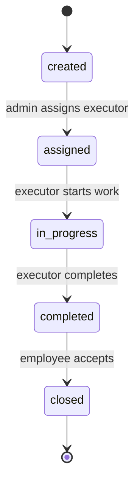

# REST API

## Общие правила

Backend предоставляет REST API FastAPI. Интерактивная OpenAPI-документация доступна после запуска по адресу `http://localhost:8000/docs`.

Для закрытых endpoint используется заголовок:

```http
Authorization: Bearer <access_token>
```

## Авторизация и справочники

| Метод | Endpoint | Доступ | Назначение |
|---|---|---|---|
| `POST` | `/auth/login` | Публичный | Вход по логину и паролю, выдача JWT. |
| `GET` | `/auth/me` | Авторизованный пользователь | Текущий пользователь и роли. |
| `GET` | `/roles` | Авторизованный пользователь | Список ролей. |
| `GET` | `/admin/users` | `admin` | Список пользователей для назначения исполнителя. |
| `GET` | `/ticket-categories` | Авторизованный пользователь | Активные категории заявок. |
| `GET` | `/ticket-statuses` | Авторизованный пользователь | Справочник статусов. |

## Заявки

| Метод | Endpoint | Доступ | Назначение |
|---|---|---|---|
| `GET` | `/tickets` | `employee`, `executor`, `admin` | Список заявок с учетом роли и фильтров. |
| `POST` | `/tickets` | `employee` | Создание заявки. |
| `GET` | `/tickets/{ticket_id}` | Участник заявки или `admin` | Карточка заявки. |
| `PATCH` | `/tickets/{ticket_id}/assign` | `admin` | Назначение активного исполнителя. |
| `PATCH` | `/tickets/{ticket_id}/status` | `employee`, `executor` | Изменение статуса по правилам жизненного цикла. |
| `GET` | `/tickets/{ticket_id}/history` | Участник заявки или `admin` | История заявки. |
| `GET` | `/tickets/{ticket_id}/comments` | Участник заявки или `admin` | Комментарии заявки. |
| `POST` | `/tickets/{ticket_id}/comments` | Участник заявки или `admin` | Добавление комментария. |
| `GET` | `/tickets/{ticket_id}/notifications` | Участник заявки или `admin` | Журнал уведомлений по заявке. |

Фильтры `GET /tickets`:

| Параметр | Назначение |
|---|---|
| `status_code` | Отбор по статусу. |
| `category_id` | Отбор по категории. |
| `assignee_id` | Отбор по исполнителю. |
| `date_from` | Нижняя граница даты создания. |
| `date_to` | Верхняя граница даты создания. |

## Отчеты

| Метод | Endpoint | Доступ | Назначение |
|---|---|---|---|
| `GET` | `/reports/summary` | `admin`, `manager` | Сводка по заявкам, SLA, статусам, категориям и нагрузке исполнителей. |

Параметры `GET /reports/summary`:

| Параметр | Назначение |
|---|---|
| `date_from` | Начало периода по дате создания заявки. |
| `date_to` | Конец периода по дате создания заявки. |

## Служебные endpoint

| Метод | Endpoint | Доступ | Назначение |
|---|---|---|---|
| `GET` | `/health` | Публичный | Проверка доступности backend и подключения к базе данных. |

## Статусы жизненного цикла



Недопустимые переходы блокируются backend. Прямой переход в `assigned` через endpoint смены статуса запрещен: назначение выполняется только через `/tickets/{ticket_id}/assign`.
