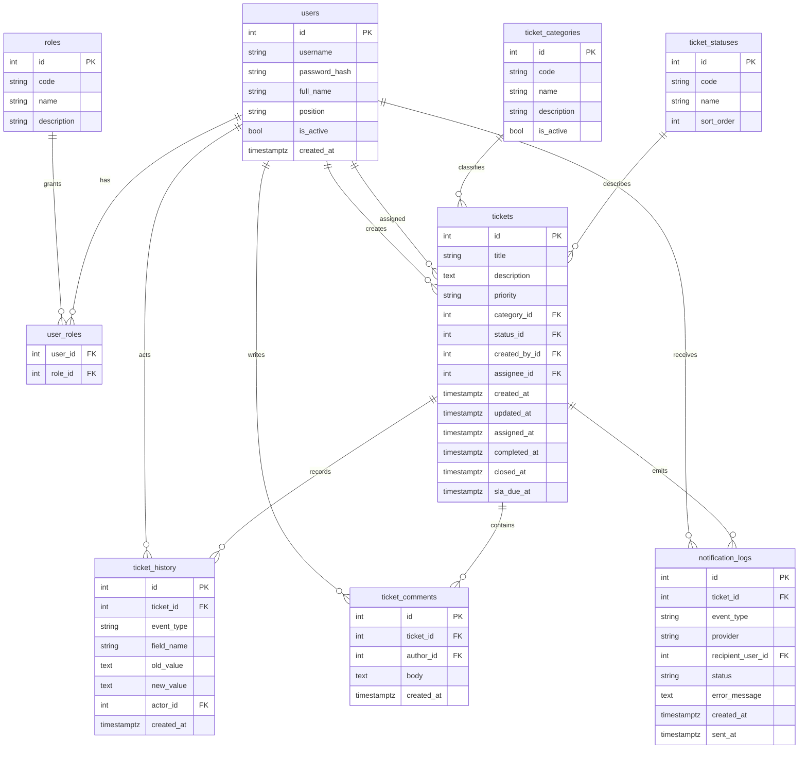

# Модель данных и ER-диаграмма

## ER-диаграмма

## Справочники

| Таблица | Назначение |
|---|---|
| `roles` | Роли `employee`, `executor`, `admin`, `manager`. |
| `ticket_categories` | Категории заявок: IT, доступы, хозяйственные и организационные обращения. |
| `ticket_statuses` | Статусы `created`, `assigned`, `in_progress`, `completed`, `closed`. |

## Основные сущности

| Сущность | Назначение |
|---|---|
| `users` | Учетные записи демонстрационных пользователей. Пароли хранятся как bcrypt-хеши. |
| `tickets` | Заявки, их текущий статус, исполнитель, сроки SLA и временные отметки жизненного цикла. |
| `ticket_history` | Аудит ключевых событий: создание, назначение, смена статуса, комментарии. |
| `ticket_comments` | Текстовые комментарии участников обработки заявки. |
| `notification_logs` | Результаты отправки mock/MAX-уведомлений. |

## SLA

Срок SLA рассчитывается при создании заявки по приоритету:

| Приоритет | Срок |
|---|---:|
| `critical` | 4 часа |
| `high` | 24 часа |
| `normal` | 48 часов |
| `low` | 72 часа |

Признак просрочки не хранится отдельно. API вычисляет `is_overdue`, если `sla_due_at` меньше текущего времени, а статус не равен `completed` или `closed`.
