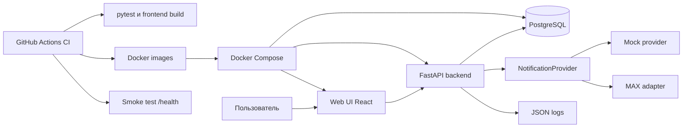
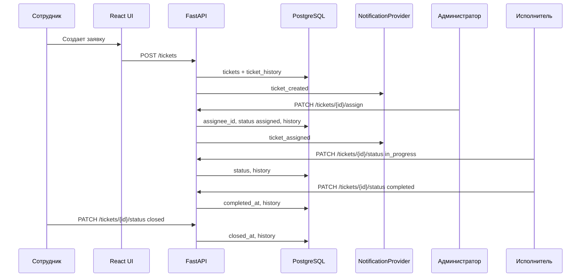

# Архитектура системы

## Назначение

Система внутренних заявок построена как учебный веб-прототип с разделением frontend, backend и базы данных. Архитектура ориентирована на повторяемый локальный запуск, проверяемые миграции, автоматические тесты и демонстрацию DevOps-процесса поставки.

## Компонентная схема

## Основные модули

| Модуль | Ответственность |
|---|---|
| `frontend/src` | Интерфейс входа, списки заявок, карточка заявки, комментарии, история, уведомления, отчеты. |
| `backend/app/main.py` | REST API, бизнес-правила жизненного цикла заявок, отчеты, вызов уведомлений. |
| `backend/app/auth.py` | Аутентификация, JWT, проверка текущего пользователя и ролей. |
| `backend/app/notifications.py` | Заменяемый mock/MAX-провайдер уведомлений. |
| `backend/app/structured_logging.py` | Структурированные логи и маскирование чувствительных полей. |
| `database/migrations` | Версионированная схема БД, справочники, seed-пользователи и демонстрационные заявки. |
| `.github/workflows/ci.yml` | Автоматическая проверка, сборка Docker-образов и smoke-тест. |

## Поток обработки заявки

## Архитектурные ограничения

- Backend является единственной точкой доступа к PostgreSQL для пользовательских сценариев.
- Все закрытые endpoint требуют JWT.
- Ролевые проверки выполняются на backend, а frontend только скрывает недоступные действия для удобства.
- В заявках, комментариях, логах, seed-данных и дампах запрещены медицинские данные пациентов.
- MAX-интеграция вынесена за интерфейс `NotificationProvider`, поэтому учебный mock-режим не требует реальных токенов.
