# DevOps-процесс и CI/CD

## Цель

DevOps-процесс показывает, что приложение можно проверять, собирать и запускать повторяемо. Для учебного проекта pipeline реализован в GitHub Actions и локально воспроизводится через Docker Compose.

## Схема pipeline

```mermaid
flowchart LR
    push[push / pull_request / workflow_dispatch] --> checkout[Checkout]
    checkout --> py[Python 3.12]
    py --> deps[pip install]
    deps --> compile[compileall]
    compile --> migrations[Alembic upgrade head]
    migrations --> pytest[pytest]
    pytest --> node[Node 22]
    node --> npmci[npm ci]
    npmci --> build[npm run build]
    build --> dockerbuild[docker compose build]
    dockerbuild --> composeup[docker compose up]
    composeup --> smoke[GET /health]
    smoke --> cleanup[docker compose down]
```

## Шаги проверки

| Шаг | Команда или действие | Назначение |
|---|---|---|
| Python quality | `python -m compileall backend/app backend/tests database/migrations` | Проверка синтаксиса Python-кода и миграций. |
| Миграции | `alembic upgrade head` | Проверка применимости схемы БД. |
| Backend tests | `pytest` | Unit, API, integration, smoke и security-тесты. |
| Frontend build | `npm ci`, `npm run build` | Установка зависимостей и production-сборка React. |
| Docker build | `docker compose build` | Сборка backend и frontend образов. |
| Smoke test | `curl http://localhost:18000/health` | Проверка запущенного контейнерного backend. |

## Секреты и конфигурация

- В CI используется `JWT_SECRET_KEY` из GitHub Secrets либо учебное значение-заглушка.
- `NOTIFICATION_PROVIDER=mock`, поэтому реальный `MAX_BOT_TOKEN` не нужен.
- Реальные секреты запрещено хранить в `.env.example`, workflow, README, логах и дампах БД.
- Локальный `.env` создается пользователем и не попадает в Git.

## Откат

Учебная модель отката: вернуться к предыдущему успешному commit или tag, заново выполнить pipeline и поднять контейнеры из пересобранных образов. Для промышленного режима этот подход расширяется публикацией версионированных Docker-образов в registry и переключением deployment на предыдущий тег.

## Структурированные логи

Backend пишет JSON-логи для ключевых событий:

- создание заявки;
- назначение исполнителя;
- изменение статуса;
- ошибка доставки уведомления;
- ошибка авторизации.

В логах фиксируются технические идентификаторы, статусы и типы событий. Тексты заявок, комментарии, токены, пароли и медицинские данные не логируются.
